# 📱 MoneyMate – Personal Finance App

**MoneyMate** is a cross-platform mobile application built with **Flutter** and powered by **Firebase**. It helps users efficiently and intuitively manage their personal income and expenses, while ensuring data safety and ease of use.

---

## 🎯 Project Scope

### 💰 Transaction Management
- Record income or expense entries with:
  - Amount
  - Date
  - Category (e.g., food, salary, entertainment)
  - Optional notes

### 🗂️ Category Management
- Create, edit, and delete custom income/expense categories.

### 📜 Transaction History
- View past transactions by date or category to keep track of personal finances.

### 📊 Visual Reports
- Display **pie** and **bar** charts to visualize income and spending habits clearly.

### 🔐 User Authentication
- Sign up and log in via:
  - Email/password
  - Phone number with OTP
  - Google account  
- All authentication handled securely using **Firebase Authentication**.

### ☁️ Data Storage
- Store all user data in **Firebase Firestore**, ensuring real-time updates and secure access.

### ⚙️ Account Management
- Edit personal information
- Change password
- Manage wallet types (e.g., cash, bank transfer)

### 🖥️ User Interface (UI)
- Clean, modern design
- Calendar view for transactions
- Dashboard for financial summaries
- Customizable settings screen

---

## 🚧 Future Features (Planned)
- Budget planning
- Payment reminders
- Multi-device data synchronization

---

## 👤 Target Users
- Students, professionals, and homemakers who want better control of their finances
- Users interested in understanding their spending habits and planning budgets
- Tech-savvy individuals who prefer managing finances on their mobile devices

---

## 🛠️ Technologies Used

| Component              | Technology                               |
|------------------------|-------------------------------------------|
| Frontend               | Flutter                                   |
| Backend/Auth           | Firebase Authentication                   |
| Database               | Firebase Firestore                        |
| Charts                 | `fl_chart` or similar charting libraries |
| Google Sign-In         | Firebase Auth + Google Integration        |
| Phone Auth (OTP)       | Firebase Phone Authentication             |

---

## 📸 Demo Screenshots & Videos

Below are some example screenshots showcasing the main features and interfaces of the MoneyMate app.

> **Note:** All screenshots should be placed in the `screenshots/` folder inside the project directory.

---

### 🔐 Authentication
**Login Screen** – Authenticate via MoneyMate account or Google  
  

**Register – Phone Number Verification**  
  
  

**Register – Email Verification**  
  

**Final Registration Step**  
  

**Forgot Password** – Reset password via email verification code  
  

---

### 🏠 Main Features
**Home Screen** – Overview of balance, monthly income/expenses chart, and quick category list  
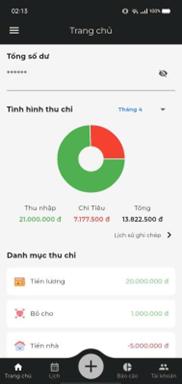  

**Transaction History** – View transactions by date  
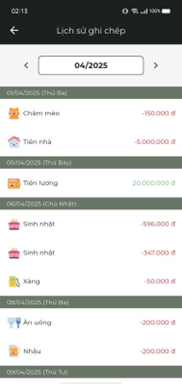  

**History by Category** – View spending within a specific category  
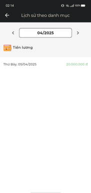  

**Add Expense** – Add and save a new expense  
  

**Expense Categories** – List of existing expense categories  
  

**Add Expense Category** – Create a new category  
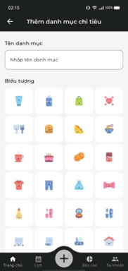  

**Add Income** – Add and save a new income entry  
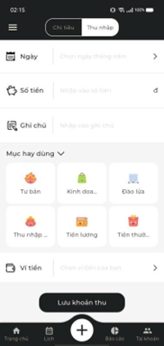  

**Income Categories** – List of existing income categories  
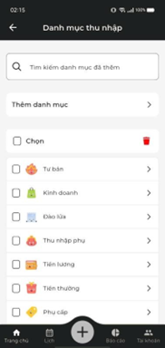  

**Add Income Category** – Create a new income category  
  

---

### 📅 Calendar & Reports
**Calendar** – Monthly view with marked transaction days  
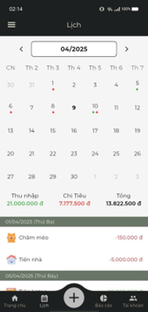  
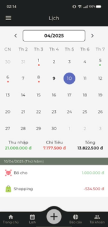  

**Expense Report** – Column and pie charts with detailed list  
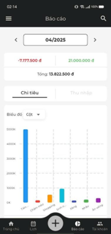  
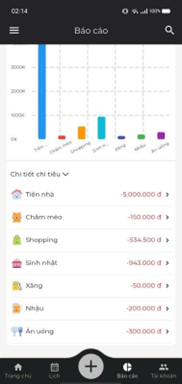  

**Income Report** – Column and pie charts with detailed list  
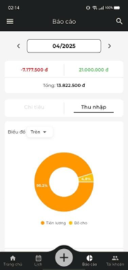  
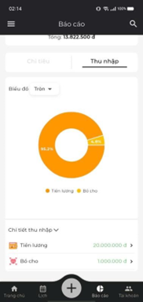  

---

### ⚙️ Account & Settings
**Account** – View and update user profile  
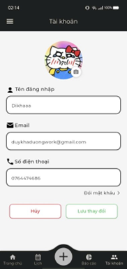  

**Change Password** – Update login password  
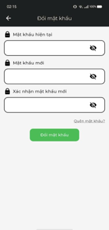  

**Drawer Menu** – Access notifications, wallets, settings, and logout  
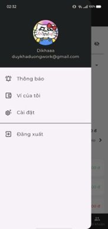  

**Notifications** – View app activity updates  
  

**My Wallet** – Overview of total cash and bank transfers  
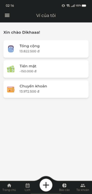  

**Settings** – Language, currency, theme, and data management  
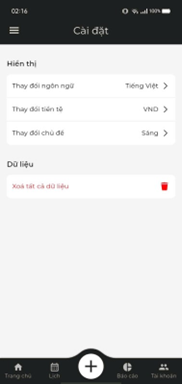  

---

### 🎥 Demo Video
You can also watch a short demo video of the app:  
[![Watch the video]](https://youtu.be/AHH3pqcdFY4)

---

**Note:** This version focuses on core features. Advanced tools like budgeting and reminders are planned for future releases.
